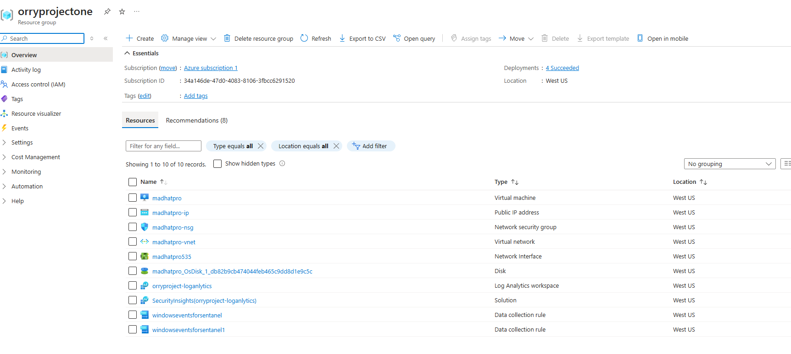
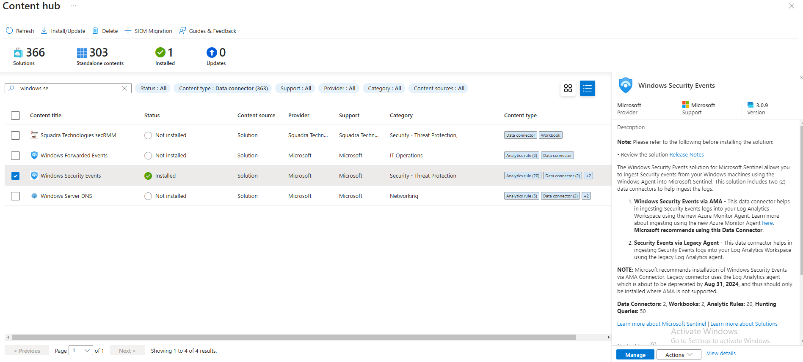
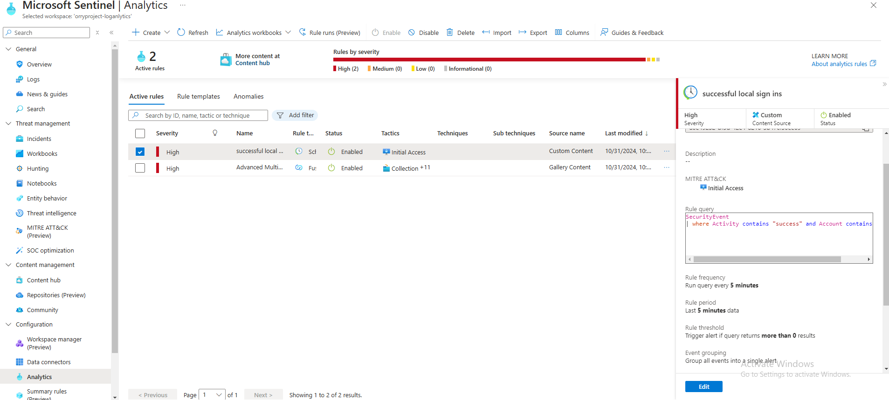
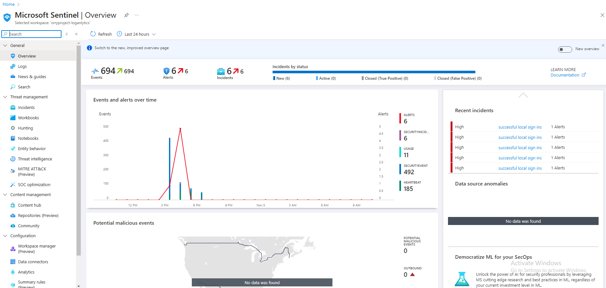

[Link to another page](./another-page.html).

This is going to be my collection of projects that are related to cybersecurity starting with basics to advance. Please join me on this journey and try some out for yourself !!

# Live SIEM Monitor for RDP log ins 

This is an example of a live SIEM that is monitoring a windows 10 vm for rdp logins. 

Step 1 create a azure vm by first makeing a recorce group to house all our recorces for the vm.



Step 2 Add microsoft sentanel to your logs work space 


As you can see my resource group is house all the things i need to run my vm including my log analytics work space witch is needed to send the event info to my siem.


Step 3 We need to setp up a data conector to our log work space so that it can now send the data logs to your siem. we will do this by going into the conent hub that is is microsoft sentinel and installing the "Windows security events" and make a data colection rule and conect it to our vm so it can pull the data it needs 



Step 4 We need to create a rule in our sentinel for successful logins via RDP. we will go into logs and start a new rule that will run every 5 minutes !




Step 4 Lets turn on our vm and let it run now that everything is in place this should start colecting log ins and triggering alerts for us !



AS you can see it worked we are able to know pull our logs from our vm and see the alerts in real time on our sentinel page !!!


## STOP THIS IS THE END FOR NOW 


>
> When something is important enough, you do it even if the odds are not in your favor.

### Header 3

```js
// Javascript code with syntax highlighting.
var fun = function lang(l) {
  dateformat.i18n = require('./lang/' + l)
  return true;
}
```

```ruby
# Ruby code with syntax highlighting
GitHubPages::Dependencies.gems.each do |gem, version|
  s.add_dependency(gem, "= #{version}")
end
```

#### Header 4

*   This is an unordered list following a header.
*   This is an unordered list following a header.
*   This is an unordered list following a header.

##### Header 5

1.  This is an ordered list following a header.
2.  This is an ordered list following a header.
3.  This is an ordered list following a header.

###### Header 6

| head1        | head two          | three |
|:-------------|:------------------|:------|
| ok           | good swedish fish | nice  |
| out of stock | good and plenty   | nice  |
| ok           | good `oreos`      | hmm   |
| ok           | good `zoute` drop | yumm  |

### There's a horizontal rule below this.

* * *

### Here is an unordered list:

*   Item foo
*   Item bar
*   Item baz
*   Item zip

### And an ordered list:

1.  Item one
1.  Item two
1.  Item three
1.  Item four

### And a nested list:

- level 1 item
  - level 2 item
  - level 2 item
    - level 3 item
    - level 3 item
- level 1 item
  - level 2 item
  - level 2 item
  - level 2 item
- level 1 item
  - level 2 item
  - level 2 item
- level 1 item

### Small image


### Large image


### Definition lists can be used with HTML syntax.

<dl>
<dt>Name</dt>
<dd>Godzilla</dd>
<dt>Born</dt>
<dd>1952</dd>
<dt>Birthplace</dt>
<dd>Japan</dd>
<dt>Color</dt>
<dd>Green</dd>
</dl>

```
Long, single-line code blocks should not wrap. They should horizontally scroll if they are too long. This line should be long enough to demonstrate this.
```

```
The final element.
```
